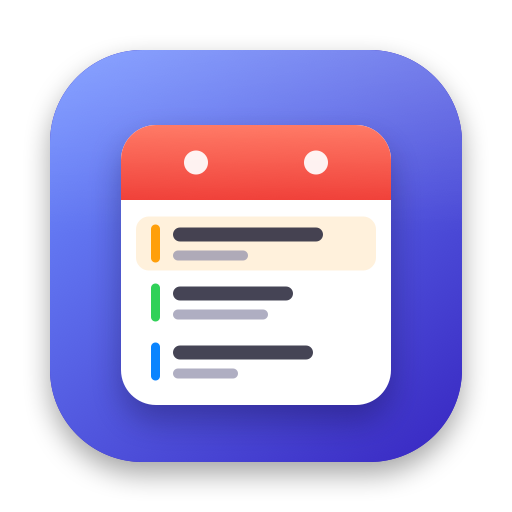

<p align="center"></p>

# Soonbar

A small, native macOS menu bar calendar. It shows your next event at a glance, and one click opens a month
overview with a merged agenda of every calendar and reminder list on your Mac. Small on purpose: it does a
few things well and stays out of your way.

## Features

- **Menu bar:** today's date icon plus the next event: `Standup · in 12m`, `Focus · 20m left`.
- **Popover:** month grid with per-day color dots and an agenda for the next 7 days (configurable).
- **Every account, one list:** iCloud, Google, Exchange, CalDAV — whatever is set up in
  *System Settings → Internet Accounts*. Each row shows its calendar color and an account badge.
- **Quick add (⌥⌘N from anywhere):** type `Lunch with Sara tomorrow 1pm 1h #work` and check the pre-filled form.
  Start with `!` for a reminder (`!Pay rent friday`).
- **Reminders:** due and overdue reminders sit in the agenda; tick them off in place (with a 2-second undo).
- **Meetings:** a Join button for Zoom, Google Meet, Teams, Webex, FaceTime and Slack links; ⌥⌘J joins the
  current meeting, opening Zoom/Teams in their desktop apps when installed.
- **Also:** hides the same meeting invited to two accounts, shows free time between today's meetings,
  keyboard navigation, launch at login.

## Requirements

- macOS 14 or later.
- Swift 6 toolchain. Xcode is **not** required — the Command Line Tools are enough
  (`xcode-select --install`).

## Build and run

```bash
scripts/run.sh          # debug build, relaunches the app from build/
scripts/install.sh      # release build into ~/Applications (use this for launch at login)
scripts/test.sh         # unit tests (Swift Testing)
```

On first launch, click the menu bar icon → **Grant Access** and allow Calendars and Reminders.

> The app is ad-hoc signed, so macOS treats every rebuild as a new app and may ask for Calendar/Reminders
> access again. To avoid that, create a code-signing certificate in Keychain Access and build with
> `SIGN_IDENTITY="<certificate name>" scripts/install.sh`.

## Quick add syntax

| You type | You get |
|---|---|
| `Focus block` | Event today at the next half hour, 30 minutes |
| `Review for 45m` / `Planning 1h30m` | Event with that duration |
| `Offsite tomorrow` | All-day event |
| `Workshop friday from 2pm to 4pm` | Event 14:00–16:00 on Friday |
| `Standup 9:30 #work` | Event in the calendar whose name matches `work` |
| `!Call mom tomorrow at 6pm` | Reminder with a due time |

Dates are parsed with Apple's `NSDataDetector` (English phrases). Anything you edit in the form by hand stays
put while you keep typing.

## Keyboard

| Key | Action |
|---|---|
| ⌥⌘N | Quick add (global) |
| ⌥⌘J | Join current meeting (global) |
| ← → ↑ ↓ | Move the selected day |
| ⌘← ⌘→ | Previous / next month |
| T | Today |
| ⌘N / ⌘, / ⌘P | New / Settings / Keep popover open |

Global shortcuts can be changed in Settings → Shortcuts.

## Project layout

```
Sources/SoonbarCore/        Pure Swift logic (menu bar title, agenda, month grid, quick-add parser, meeting links)
Sources/Soonbar/  AppKit status item, SwiftUI popover and settings, EventKit adapter
Tests/SoonbarCoreTests/     Unit tests for SoonbarCore
scripts/                 Build, run, install, test, and icon generation
docs/                    Design spec, implementation plan, QA checklist
```

All decisions the UI shows are made in `SoonbarCore`, which only depends on Foundation, so they're unit-tested
without EventKit. The app target is a thin layer that reads EventKit and renders.
