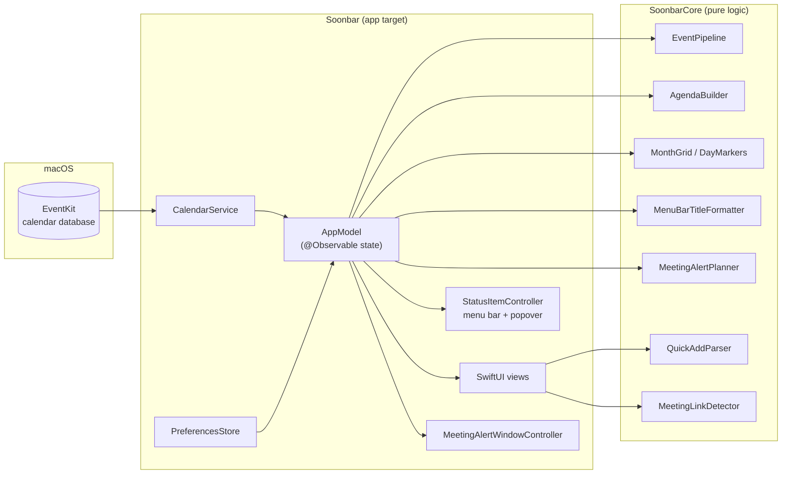
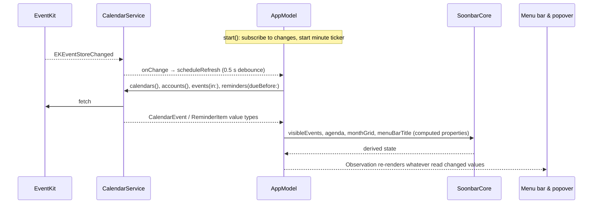

# How Soonbar works

This document explains how the app is put together: the two layers, how data flows from your calendars to the
menu bar, and how each feature works under the hood. For setting up a development environment and making
changes, see [DEVELOPMENT.md](DEVELOPMENT.md).

## The big picture

Soonbar is a menu-bar-only macOS app (no Dock icon, `LSUIElement`). It never talks to Google, Microsoft
or iCloud directly. It reads the calendar database macOS already keeps in sync for every account in
*System Settings → Internet Accounts*, through Apple's **EventKit** framework.

The code is split into two SwiftPM targets:

| Target | What it contains | Depends on |
|---|---|---|
| **`SoonbarCore`** (library) | Every decision the app makes: what the menu bar says, how the agenda is grouped, how quick-add text is parsed, when a meeting alert fires, which link joins a meeting. Pure value types and functions. | Foundation only |
| **`Soonbar`** (app) | The thin layer around it: EventKit access, the status item and popover, SwiftUI views, settings, hotkeys, updates. | SoonbarCore, AppKit, SwiftUI, EventKit, Sparkle |

**Why this split matters:** everything in `SoonbarCore` is deterministic. You pass in events, a `now` and a
`Calendar`, and get an answer back, so it is covered by fast unit tests (`Tests/SoonbarCoreTests`) with no
EventKit, no permissions and no UI. The app target only moves data in and out. When you add behavior, put the
decision in `SoonbarCore` and test it there; keep the app layer as glue.

## Data flow

1. **`CalendarService`** is the only type that imports EventKit. It asks for permission, fetches events and
   reminders for a date range, and maps `EKEvent`/`EKReminder` into SoonbarCore's plain structs
   (`CalendarEvent`, `ReminderItem`, `CalendarInfo`, `AccountInfo`). It also saves new events and reminders and
   ticks reminders off.
2. **`AppModel`** (`@Observable`, main actor) holds the raw data plus UI state (displayed month, selected day,
   popover mode, toast). Everything the UI shows is a **computed property** that calls SoonbarCore:
   `visibleEvents`, `agenda`, `monthGrid`, `dayMarkers`, `menuBarTitle`. There is no cached derived state to
   keep in sync.
3. **Views** read the model through the SwiftUI environment. **`StatusItemController`** renders the menu bar
   item with `withObservationTracking`, re-arming after each change.

### What triggers a refresh

| Trigger | Why |
|---|---|
| `EKEventStoreChanged` (debounced 0.5 s) | Any change from any app or sync |
| Opening the popover | Catch anything missed while closed; also resets the popover to today |
| Day change, system clock change, time-zone change | Day boundaries move (time-zone change also resets Foundation's cached zone) |
| Wake from sleep | Timers don't fire while asleep |
| Changing month, agenda length or first weekday | The fetched date range changes |
| Minute ticker | Only updates `now` (no fetch) so countdowns stay exact; aligned to minute boundaries |

The fetch window covers the displayed month grid (6 weeks) plus the upcoming agenda range, whichever is wider.

## Features under the hood

### Menu bar title — `MenuBarTitleFormatter`

Chooses one event and formats it as `Title · in 12m` or `Title · 8m left`:

1. An upcoming event starting within **10 minutes** wins (`in 8m`, `now`).
2. Otherwise an **ongoing** event, the one ending soonest (`8m left`).
3. Otherwise the next upcoming event, if it falls inside the user's window (30 min … rest of today … always).

All-day, declined and cancelled events never appear. Titles are truncated to the configured length. The icon
next to it is drawn by `CalendarIconRenderer` as a template image so macOS tints it for any menu bar.

### Many accounts, one agenda — `EventPipeline`, `AgendaBuilder`

- `EventPipeline.visible` removes hidden calendars, cancelled and declined events, then **deduplicates**: the
  same meeting invited to two accounts (same normalized title, start, end, all-day flag) is shown once, keeping
  the copy from the highest-priority calendar (the default quick-add account first, then account order).
- `AgendaBuilder` groups by day for the next N days, puts **overdue reminders** at the top of today, collapses
  today's already-ended events behind "Show N earlier", orders entries (all-day events, date-only reminders,
  then timed items) and inserts **free-time** gaps (`FreeTimeCalculator`, ≥ 30 min within working hours).
- Each row's account badge comes from `AccountBadge`: the first letter of the account name, or of the email's
  domain (`jane@bluebird.com` → `B`) so two addresses with the same initial still differ. Users can override it.

### Month grid — `MonthGrid`, `DayMarkers`

Always 6 rows (so the popover never changes height), rotated to the chosen first weekday, with week numbers from
the calendar. `DayMarkers` gives each day up to three distinct calendar colors in time order.

### Quick add — `QuickAddParser`

`Lunch with Sam tomorrow 1pm 1h #personal` is parsed in stages, each removing what it understood:

1. Leading `!` → reminder instead of event.
2. `#token` → calendar or list: exact name, then prefix, then substring match (case and spaces ignored), only
   among writable calendars of the right kind.
3. Duration: `45m`, `1h30m`, `1.5h`, `for 2 hours`.
4. Date and time via Apple's `NSDataDetector`. The detector sometimes swallows title words ("Dinner friday
   7pm" is one match), so the parser peels non-date words off the edges while the rest still means the same date.
5. Whatever is left is the title.

`QuickAddView` re-parses on every keystroke and shows the result as an editable form; fields the user edits by
hand stop being overwritten. `QuickAddDraft.normalized` makes all-day events exactly one calendar day on save.

### Reminders

Reminders due in the visible range (and all overdue ones) are fetched incomplete. Ticking one off saves it to
EventKit immediately and keeps it on screen, struck through, for a 2-second undo window
(`AppModel.pendingCompletions`).

### Meetings — `MeetingLinkDetector`, `MeetingLauncher`

The detector looks in an event's URL, then location, then notes, for Zoom, Google Meet, Teams, Webex, FaceTime
and Slack huddle links. For Zoom and Teams it also builds a native URL (`zoommtg://…`, `msteams:…`) so
`MeetingLauncher` can open the desktop app when it's installed, falling back to the browser.

### Full-screen meeting alerts — `MeetingAlertPlanner`, `MeetingAlertWindowController`

`AppModel.rescheduleMeetingAlerts()` asks the planner which meetings are due now (alert time ≤ now, within a
**2-minute grace** window so waking up late doesn't interrupt a meeting already under way), shows them, records
their ids, then sleeps until the **next** alert moment. It re-plans after every refresh, minute tick and settings
change, so it always reflects current events. The alert is one borderless panel per display at screen-saver
level, visible on every Space and over full-screen apps.

### Opt-in meeting features — `Sources/Soonbar/Features/`

Four features are off by default; each lives in one file under `Features/` (its `AppModel` extension, state
class and Settings section) with its logic in SoonbarCore. `AppModel.updateMeetingFeatures()` drives the timed
ones after every refresh and minute tick.

- **Meeting brief** — `MeetingBriefPlanner` decides when, `MeetingBriefBuilder` what (attendees sorted organizer
  first, links from the notes minus the meeting link, trimmed notes). `MeetingBriefPanelController` shows a
  non-activating floating panel. Attendees come from EventKit into `CalendarEvent.attendees`.
- **Share availability** — `AvailabilityPlanner` finds free slots over the next working days (via
  `FreeTimeCalculator.freeSlots(events:in:minimumMinutes:)`), `AvailabilityFormatter` writes them as text.
  It fetches its own date range because it can reach past the loaded agenda.
- **Back-to-back** — `BackToBackDetector` links each meeting to the one it follows or overlaps (agenda mark);
  `MenuBarTitleSettings.showMeetingTimeLeft` keeps the current meeting in the title with a `→ next` hint and
  `MenuBarTitle.isUrgent` for the last 5 minutes.
- **Second time zone** — `SecondTimeZone` formats event times and a clock for the chosen zone; with
  `displayTimeZone`, `AvailabilityFormatter` regroups free slots by that zone's dates.
- **Invitations** — `CalendarEvent.myResponse` and `InviteStatus` read the current user's reply from the attendees;
  EventKit can't send replies, so answering goes through Calendar.
- **Meeting is over** — `AppModel.endedEarlyIDs` (in memory) removes a meeting from `activeEvents`, which feeds the
  menu bar title, the Join shortcut and meeting automations; the agenda keeps showing it, dimmed.
- **Meeting automations** — `MeetingAutomationTracker` is a small state machine that merges touching meetings
  into blocks and emits start/end actions; `ShortcutsRunner` runs them with `/usr/bin/shortcuts`.

### Global shortcuts — `HotKeyCenter`

Uses Carbon's `RegisterEventHotKey`, which works without Accessibility permission. Shortcuts are stored as
`KeyCombo` (key code + modifier mask + display character) and re-registered when changed in Settings.

### Settings — `PreferencesStore`

An `@Observable` object whose properties write through to `UserDefaults` in `didSet`. Views bind to it directly;
`AppModel` reads it in its computed properties, so most settings take effect immediately with no extra wiring.

### Updates — Sparkle

`UpdaterService` wraps Sparkle 2. It turns on only when the app's `Info.plist` contains `SUPublicEDKey`, which
`scripts/release.sh` injects into release builds. Local builds never self-update. Installed copies read
`releases/latest/download/appcast.xml`; each update zip is signed with an EdDSA key kept in the release
maintainer's keychain. Sparkle compares `CFBundleVersion`, which releases set to the git commit count.

Sparkle replaces the installed app in place, keeping its file name, and only accepts an update whose app has
that file name or the same bundle identifier. `BundleRelocator` runs first thing at launch: if the bundle isn't
named `<CFBundleName>.app` it renames itself (keeping the newer copy if both exist) and relaunches. Together with
`scripts/publish-bridge.sh` this moves installs that follow another feed over without a reinstall.

## Packaging

There is no Xcode project. `scripts/build-app.sh` builds with SwiftPM and assembles the `.app` by hand: binary,
`Info.plist` (usage descriptions for the Calendar/Reminders permission prompts, `LSUIElement`), icon and the
embedded `Sparkle.framework`, then signs it (ad-hoc by default, or `SIGN_IDENTITY`). Release builds are universal
(Apple silicon + Intel).

## Design decisions

| Decision | Why |
|---|---|
| EventKit, not per-provider sign-in | Every account macOS supports works with zero sync code and no OAuth; it also works offline |
| `NSStatusItem` + `NSPopover`, not SwiftUI `MenuBarExtra` | `MenuBarExtra` can't be opened from a global hotkey, can't be pinned open, and limits the title/icon |
| Logic in SoonbarCore with injected `now`/`Calendar` | Deterministic, fast tests; the UI can't drift from the rules |
| Computed derived state in `AppModel` | No caches to invalidate; Observation re-renders exactly what changed |
| No in-app popover opacity | `NSPopover` exposes no glass control; painting over it isn't native. The popover follows macOS's Reduce Transparency setting instead |
| Ad-hoc signing by default | No paid Apple account needed; the cost is a one-time Gatekeeper step and permission re-prompts after rebuilds (see README) |

## Other pieces

- **`Tools/DemoVideo`** renders `docs/demo.mp4` as motion graphics: SwiftUI scenes drawn from fictional sample
  data with the real SoonbarCore logic, encoded by ffmpeg. It isn't part of the app.
